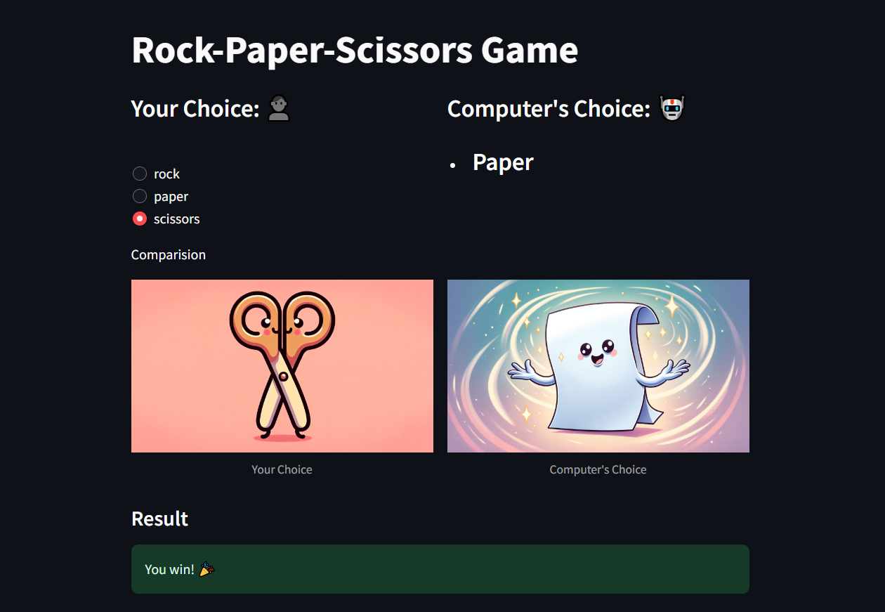

# Rock-Paper-Scissors Game 🪨 📄 ✂️

## Overview ℹ️
Rock-Paper-Scissors is a classic hand game usually played between two people. This project implements the Rock-Paper-Scissors game as an interactive web application using Streamlit and Python. The application allows users to play against the computer and keeps track of their scores.

## Features 🚀
- **User Choice:** Users can choose between rock, paper, and scissors.
- **Computer's Choice:** The computer randomly selects one of rock, paper, or scissors.
- **Result Display:** The result of the game (win, lose, or tie) is displayed along with colorful emojis.
- **Score Tracking:** The app keeps track of the user's and computer's scores for multiple rounds.
- **Play Again:** Users can choose to play another round after viewing the result.
- **User-Friendly Interface:** The app features a visually appealing and intuitive interface with image cards for user choices.

## How to Run ▶️
1. Install the necessary dependencies using `pip install -r requirements.txt`.
2. Run the Streamlit app by executing `streamlit run app.py` in the terminal.
3. Access the app via the provided URL.

## Technologies Used 🛠️
- **Streamlit:** Streamlit is used to build the interactive web application.
- **Python:** Python is the programming language used to develop the application.
- **Random Module:** The `random` module is utilized to generate random choices for the computer.
- **Time Module:** The `time` module is used to simulate delays for image loading.
- **Emoji Library:** Emojis are integrated into the app using emoji Unicode characters.

## Screenshots 📸

## Live Demo 🌐
For a live demonstration of the app, please visit [Rock-Paper-Scissors App](https://example.com).

## Future Improvements 🚧
- Add more interactive features such as sound effects.
- Implement multiplayer functionality for users to play against each other.
- Enhance the design with more animations and visual effects.

## Feedback 📢
Feedback and contributions are welcome! If you have any suggestions or ideas for improvement, please feel free to open an issue or submit a pull request.

## Author 📝

This Scientific Calculator app was developed by [Jaweria Batool](https://www.linkedin.com/in/jaweria-batool/) during an internship at Codsoft.